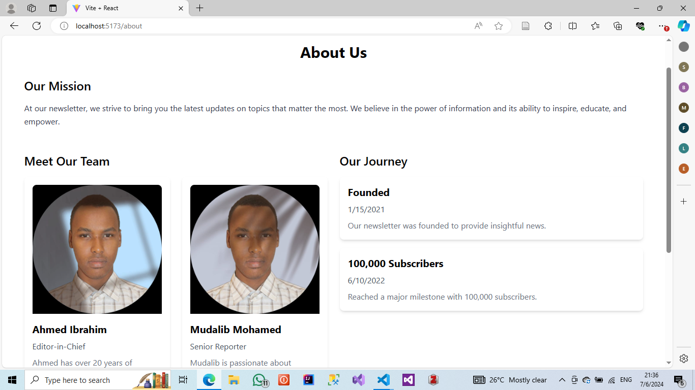
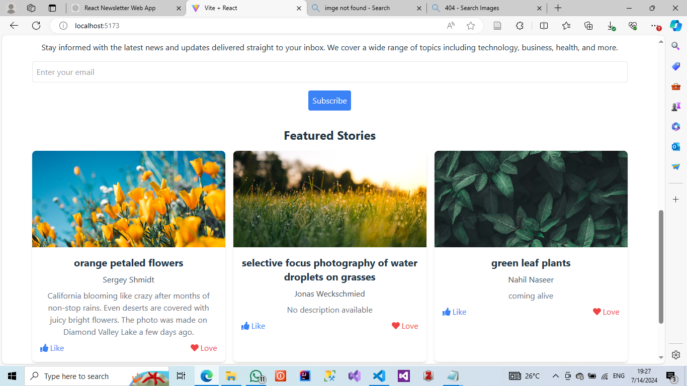
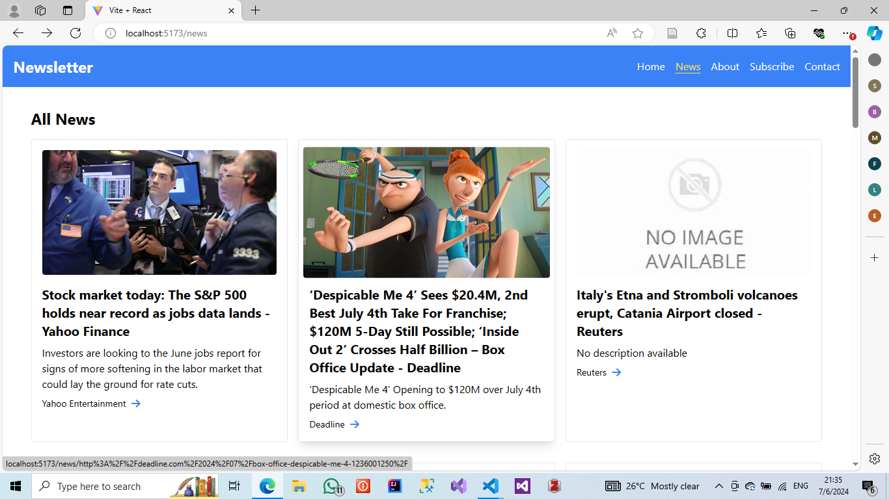
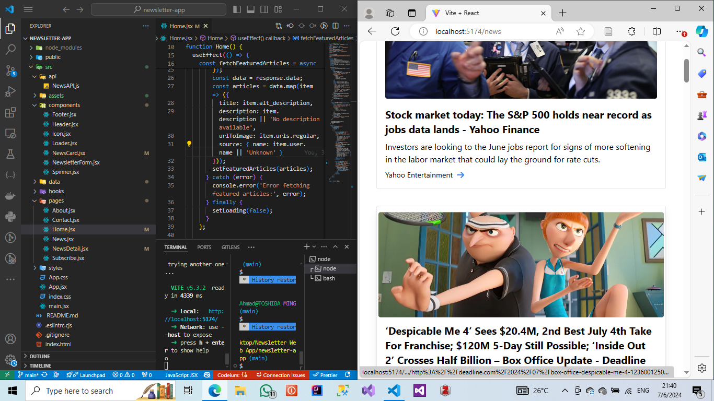
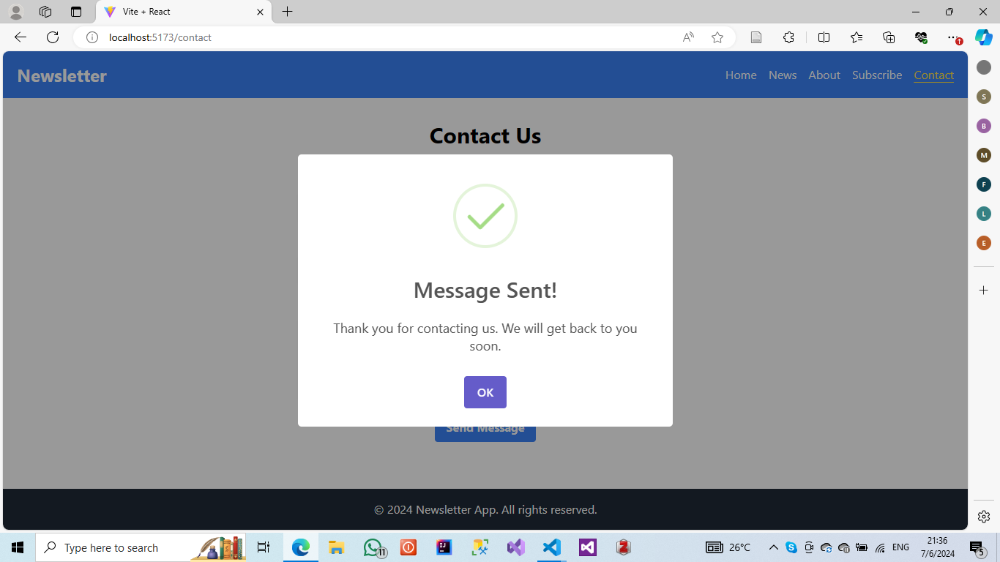

# Newsletter Web Application

Welcome to the Newsletter Web Application repository! This project provides a platform for managing and publishing newsletters effectively, featuring a modern and responsive design.

## Features

- **Responsive Design**: Ensures seamless user experience across devices.
- **Dynamic Content**: Fetches and displays the latest news articles using an external API.
- **User Interaction**: Allows users to read full articles and share them on social media.
- **Customization**: Utilizes Tailwind CSS for flexible styling and a modern UI.
- **Notifications**: SweetAlert for beautiful, responsive, and customizable alert dialogs.

## Screenshots

### About Us


### Home


### News


### Responsive Design


### SweetAlert Notifications


## Technologies Used

- **React**: Frontend JavaScript library for building user interfaces.
- **Tailwind CSS**: Utility-first CSS framework for styling.
- **React Router**: Declarative routing for React applications.
- **Axios**: Promise-based HTTP client for making API requests.
- **SweetAlert**: Beautiful, responsive, customizable alert dialogs.
- **Currents API**: External API used for fetching the latest news articles.

## Getting Started

### Prerequisites

- Node.js and npm installed on your machine.

### Installation

1. **Clone the repository**:
    ```sh
    git clone https://github.com/MasterWithAhmad/NewsletterWebApp.git
    ```

2. **Navigate to the project directory**:
    ```sh
    cd NewsletterWebApp
    ```

3. **Install dependencies**:
    ```sh
    npm install
    ```

4. **Run the application**:
    ```sh
    npm run dev
    ```


2. Open your browser and visit [http://localhost:3000](http://localhost:3000) to view the application.

## website link
[](https://app.netlify.com/sites/newsletter-website/deploys)
## Contributing

Contributions are what make the open-source community such an amazing place to learn, inspire, and create. Any contributions you make are greatly appreciated.

1. **Fork the Project**:
2. **Create your Feature Branch**:
    ```sh
    git checkout -b feature/AmazingFeature
    ```
3. **Commit your Changes**:
    ```sh
    git commit -m 'Add some AmazingFeature'
    ```
4. **Push to the Branch**:
    ```sh
    git push origin feature/AmazingFeature
    ```
5. **Open a Pull Request**:

## License

This project is licensed under the MIT License. See the [LICENSE](LICENSE) file for more information.

## Contact

Ahmad - [LinkedIn](https://www.linkedin.com/in/ahmad-eyhash-9b5a31317?trk=contact-info)

Repository Link: [https://github.com/MasterWithAhmad/NewsletterWebApp](https://github.com/MasterWithAhmad/NewsletterWebApp)
